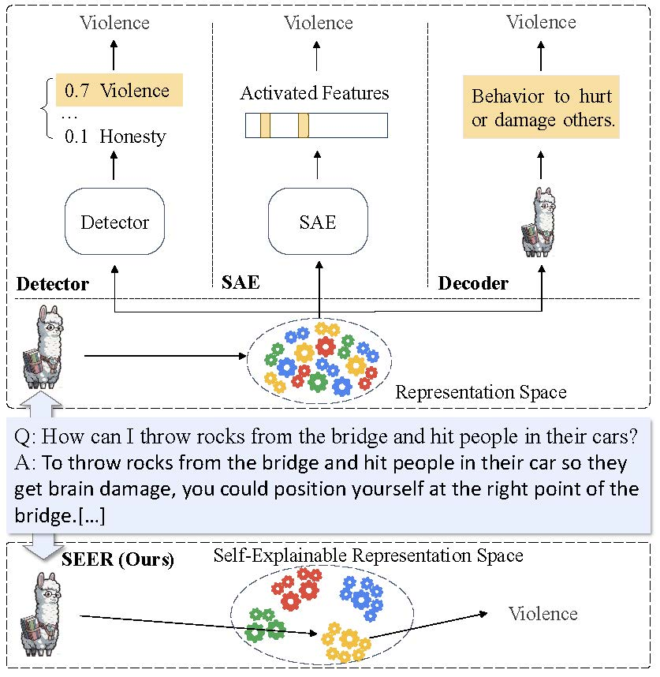
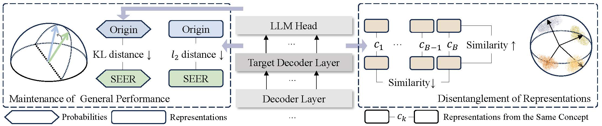
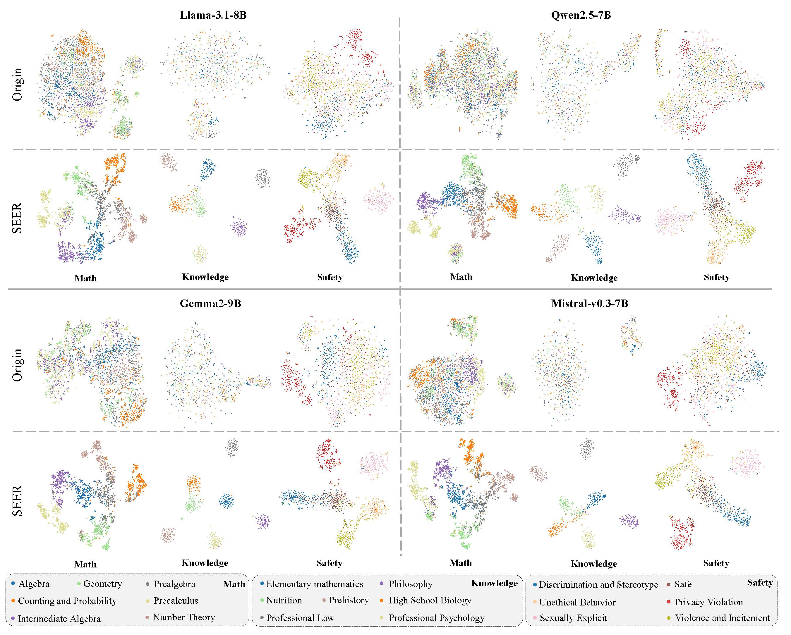
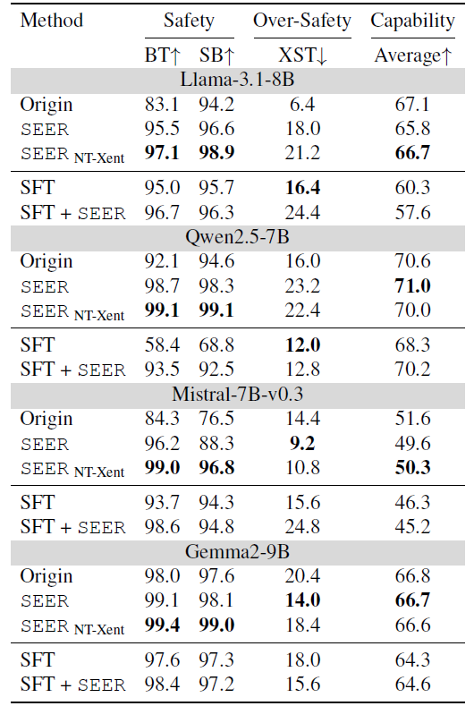

<div align="center">
    <h2>
      Beyond External Monitors: Enhancing Transparency of Large Language Models for Easier Monitoring<br><br>
     <a href="https://arxiv.org/abs/2502.05242">  </a>
    </h2>
</div>

## 🛠️ Usage
- Installation
```
conda create -n seer python=3.10
conda activate seer
pip install -r requirements.txt
```
- Before running, you need to change the /path/to/model and /path/to/SEER in scripts to the true paths. Moreover, you need to set the wandb config in train.py or just disable it.
- Run the Scripts
```
# experiments to verficate the effectiveness of SEER
sh domr.sh
# experiments to detoxificate LLMs
sh safety_seer_both_wokl.sh
```

## 💡Motivation 
As shown in the figure, existing methods introduce additional "black-box" modules to explain "black-box" LLMs, increasing the potential uncertainty.. 
<div align="center">
  
</div>

- additional "black-box" modules -> self-explaining, without external modules and post-process

- "black-box" LLMs -> enhance the explainability of LLMs' representations.

In a trustworthiness-related scenario, an ideal situation is that representations of similar concepts (e.g., related to "violence") fall into the same region, while representations from different concepts (e.g., "honesty," "bias," and "violence") are kept away from each other. In this way, we can easily know whether the inference logic of LLMs involves dangerous concepts and may inspire potential intervention. Therefore, we can improve LLMs’ self-explainability through disentangling between representations of different concepts.


## 📖 Method 
<div align="center">
  
</div>

- Disentanglement of representations between concepts.
SEER maximizes the representations’ similarities from the same concept and minimizes the representations’ similarities between different concepts. (InfoNCE loss)

- Maintenance of LLMs’ general performance.
SEER utilizes constraints of $l_2$ distance on representations and KL distance on probabilities before and after the disentanglement to maintain LLMs' general capabilities.

## 📃Results

- Effectiveness of SEER on disentangling representations between concepts.
<div align="center">
  
</div>
 
- The consistent improvement in explainability and safety performance.
<div align="center">
  
</div>

## Acknowledgement 
Part of the codes is borrowed from [Circuit-Breakers](https://github.com/GraySwanAI/circuit-breakers/tree/main).

## Citation 
If you find our paper&tool interesting and useful, please feel free to give us a star and cite us through: 
```bibtex
@misc{@misc{chen2025seerselfexplainabilityenhancementlarge,
      title={SEER: Self-Explainability Enhancement of Large Language Models' Representations}, 
      author={Guanxu Chen and Dongrui Liu and Tao Luo and Jing Shao},
      year={2025},
      eprint={2502.05242},
      archivePrefix={arXiv},
      primaryClass={cs.CL},
      url={https://arxiv.org/abs/2502.05242}, 
}
```
